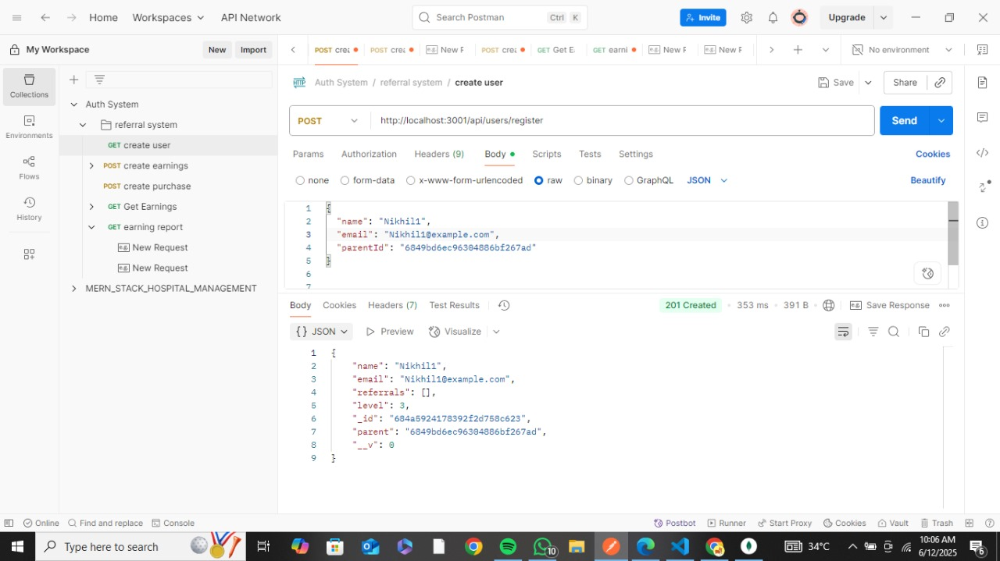
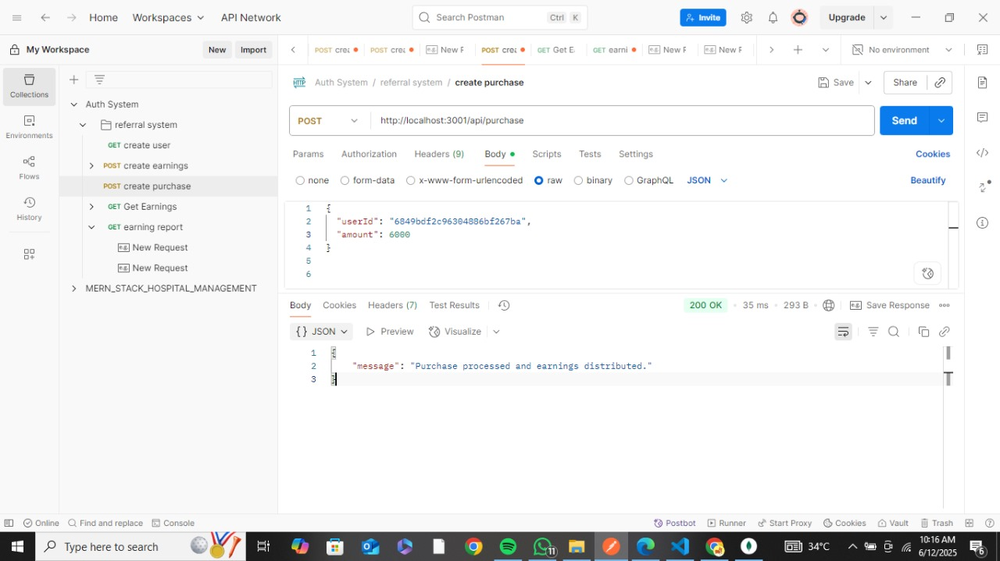
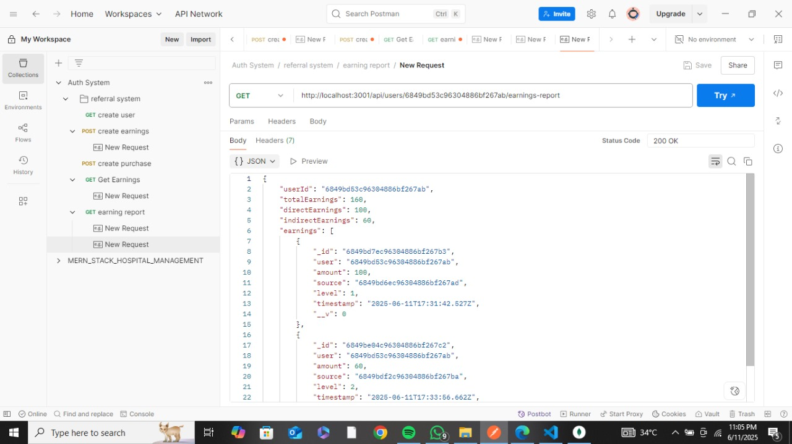
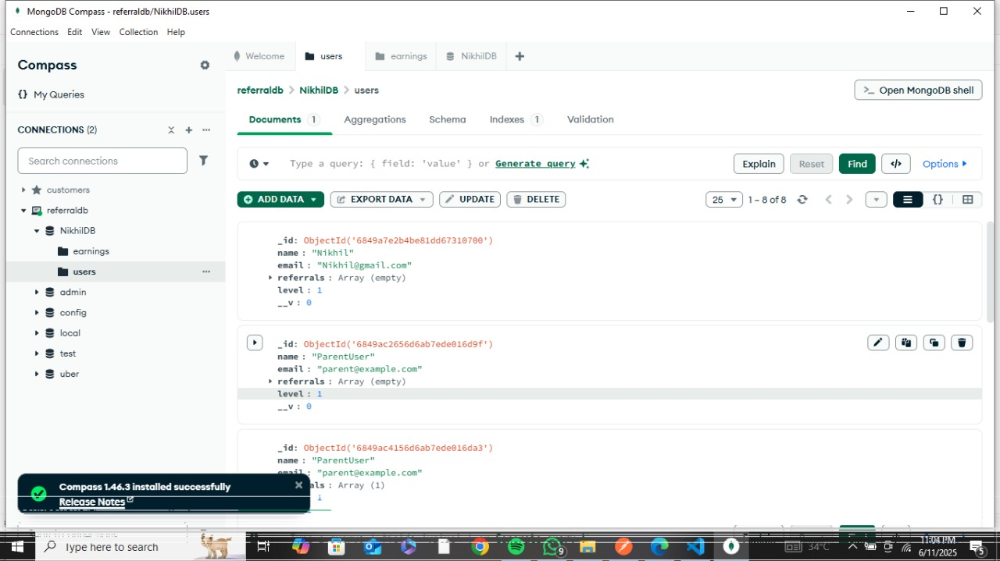

## Referral System Backend

This project is a backend system built using **Node.js**, designed to handle multi-level referral-based earnings. Users can refer others, and earnings get distributed based on referral levels — just like you'd see in a real-world referral or affiliate model.

---

## What This Project Does

- Allows new users to register with or without a referral.
- Automatically links them to a parent (referrer) if provided.
- Distributes earnings when users make purchases:
  1. 5% to their direct referrer (Level 1)
  2. to the referrer's parent (Level 2)
- Provides real-time notifications to parents when earnings are generated.
- Includes a reporting API to check how much a user has earned (both direct and indirect).

---

## Technologies Used

- **Node.js** + **Express.js** — for building APIs
- **MongoDB** + **Mongoose** — for storing users and earnings
- **Socket.IO** — for real-time notifications
- **Postman** — for testing APIs

---

## How to Run the Project Locally

1. **Clone this repo**:
   git clone https://github.com/nikhil111111/referral-system-backend.git
   cd referral-system-backend
2. **Install dependencies**:
   npm install
3. **Set up your environment variables**:
   MONGO_URI=mongodb://localhost:27017/NikhilDB
   PORT=3001
4. **Start the server**:
   npm run dev

---

## 📸 Screenshots

## Created By

**Nikhil Garg**  
[GitHub Profile](https://github.com/nikhil111111)
